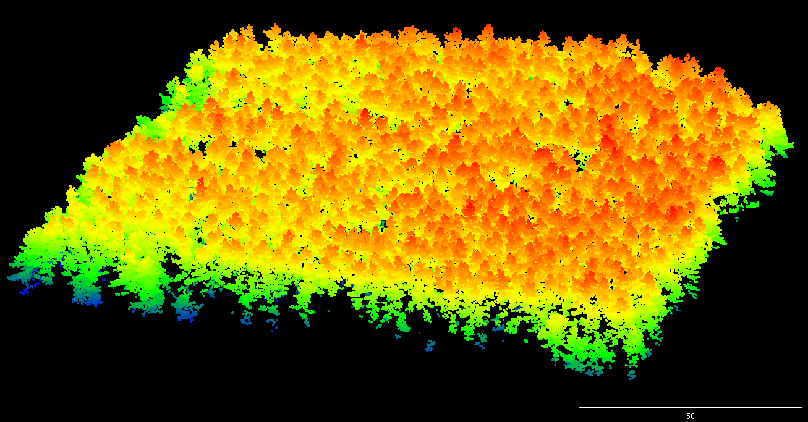
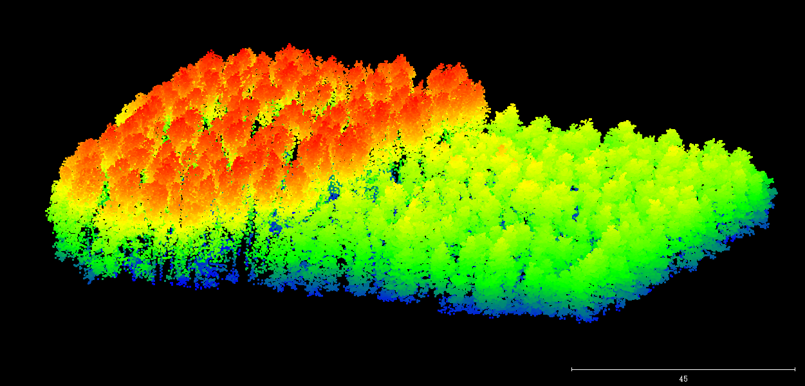
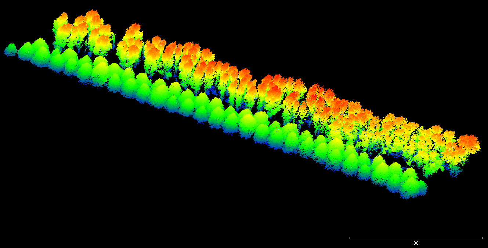
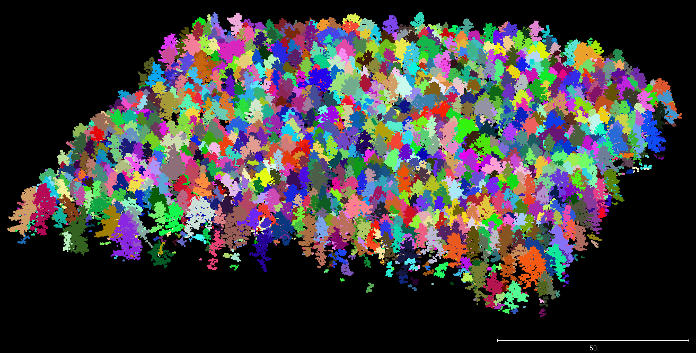
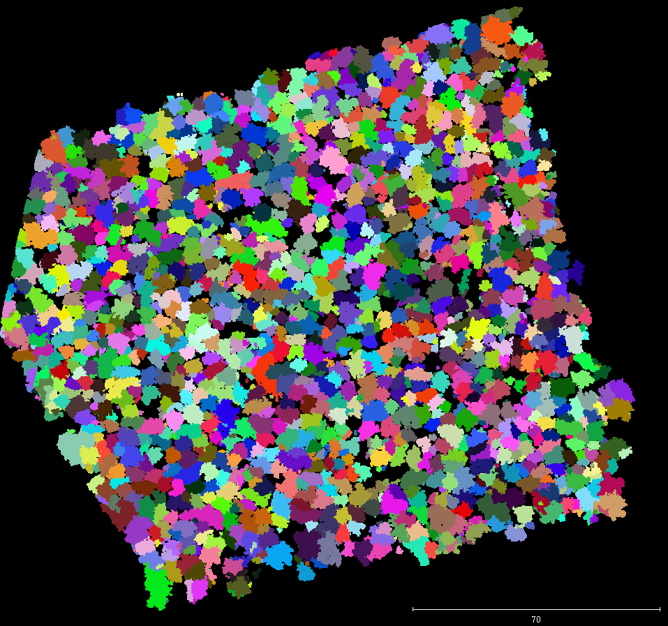
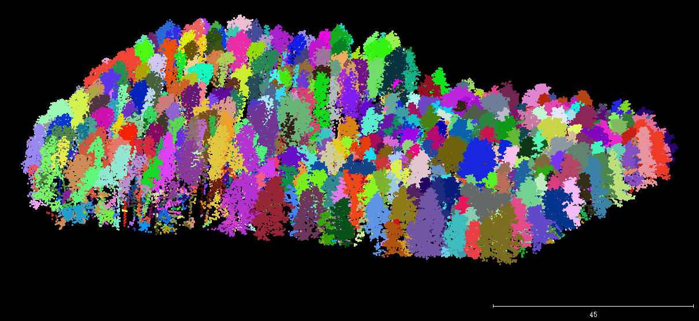
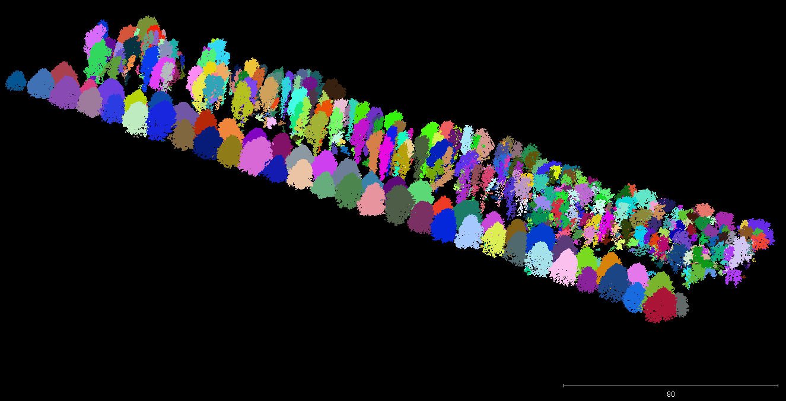

# Point-based Individual Tree Delineation from 3D LiDAR Point Cloud Data.

This module implements a lightweight and easy-to-use **_Point-based_** method for individual tree delineation from 3D point cloud data using pure C/C++.

The source codes files are included in folder **[TreeSeparation]**, which consists of a project generated from _Visual Studio 2015_. The **CLASS** for tree separation is named "FoxTree" and can be found in the respect **_FoxTree.h_** and **_FoxTree.cpp_** files. 

## Inupt
 The input of this module are **TREE Points** only, as illustrated by the figures below.






 
 The format of the tree points is **_*.xyz_**, such as:
 ``` javascript {.line-numbers}
          x            y         z          
      623772.9200 4834465.5900 77.7409     
         ...         ...        ...       
```
Note that if the original data does not have color information, either initiate the last three columns with arbitray integers or modify the code on data loading. 


## Parameters
There are three parameters have to be initialized for optimal individualization results:
     -1 Searching radius
     -2 Vertical resolution
     -3 Minimum number of points per cluster

As demonstrated by the **code snippet** below (Note that the parameters are based on geo-referenced point cloud data.):


``` javascript class:"lineNos"
	//Parameter settings
	const double radius = 1.5;  //Searching Radius, 1.5 meter;
	const double verticalResolution = 1.0;  //Vertical resolution of the layers, 1.0 meter;
	const int miniPtsPerCluster = 5; // Minimum number of points per cluster, 5 points;
```

**Hints on Parameter Settings:**

**_Radius_** should be in accordance with the average point density, i.e. to ensure there are a certain number of points within the radius.

**_VerticalResolution_** depends on the overall point density, fineness of results.

## Output
The output of this implementation is an ASCII format **_*.xyz_** file as well:
```javascript {.line-numbers}
	treeID        x            y         z         r      g     b 
	  89     623942.8999 4833932.5500   77.8399   36      76    89
	  ...         ...        ...         ...      ...    ...    ...
```
Notably, the first column is the **index of tree** of which this point is assigned. The last three columns are randomly designated color for the points of a same tree.

The individual tree delineation results are given as the figures below:





## Declarations
In this implementation,  **nanoflann** is employed for **_KNN_** searching, which can be found from here [link](https://github.com/jlblancoc/nanoflann). 

## Support & Contact

Should you have any questions, comments, BUG(s) reporting, or IDEAS for further improvements? Please contact:

**Jinhu Wang**


jinhu (dot) wang (at) hotmail.com  


or 
 
 
**Roderik Lindenbergh**


r (dot) c (dot) lindenbergh (at) tudelft.nl. 


http://doris.tudelft.nl/~rlindenbergh/

Dec. 9, 2016

Copyright (C) 2016

