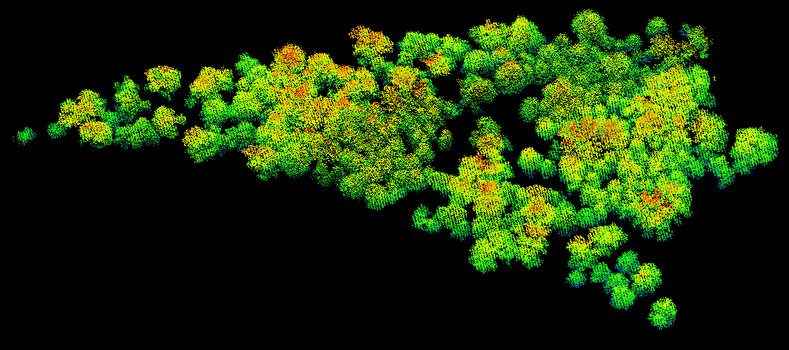
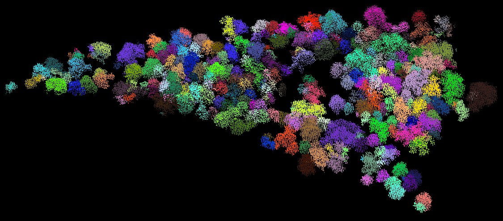

# Point-based Individual Tree Delineation from 3D LiDAR Point Cloud Data.

This module implements a lightweight and easy-to-use **water-shed** method for individual tree delineation from 3D point cloud data using pure C/C++.

## Inupt
 The input of this module is tree points only, as illustrated be the figure below.

 
 The format of the tree points is **_*.xyz_**, such as:
 ```
          x            y         z         r      g       b 
      623772.9200 4834465.5900 77.7409     0     215     39
         ...         ...        ...       ...    ...     ...
```
Note that if the original data does not have color information, either initiate the last three columns with arbitray integers or modify the code on data loading. 


## Parameters
There are three parameters has to be initiated for optimal individualization results:
     -1 Searching radius
     -2 Vertical resolution
     -3 Minimum number of points per cluster

As demonstrated by the **code snippet** below:

```markdown
	//Parameter settings
	const double Radius = 1.5;  //Searching Radius
	const double verticalResolution = 1.0;  //Vertical resolution of the layers
	const int miniPtsPerCluster = 5; // Minimum number of points per cluster
```

**Hints on Parameter Settings:**

_Radius_ should be in accordance with the average point density, i.e. to ensure there are a certain number of points within the radius.

_VerticalResolution_ depends on the overall point density, fineness of results.

## Output
The output of this implementation is an ASCII format **_*.xyz_** file as well:
```
	treeID        x            y         z         r      g     b 
	  89     623942.8999 4833932.5500   77.8399   36      76    89
	  ...         ...        ...         ...      ...    ...    ...
```
Notably, the first column is the **index of tree** of which this point is assigned. The last three columns are randomly designated color for the points of a same tree.

The individual tree delineation results is given as the figure below:



## Declarations
This implementation uses **nanoflann** for the **_KNN_** searching, originated from here [link](https://github.com/jlblancoc/nanoflann). 

## Support & Contact

Should you have any questions, comments, or suggestions, please contact:

jinhu.wang@tudelft.nl  or  r.c.lindenbergh@tudelft.nl. 

**Jinhu Wang**

https://rs.tudelft.nl/~jinhuwang/

Dec. 9, 2016

Copyright (C) 2016

