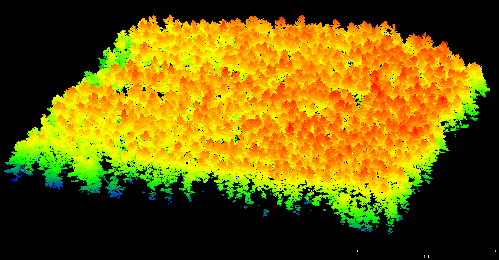
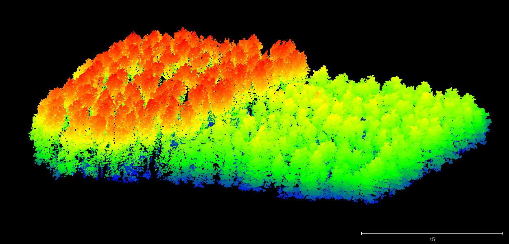
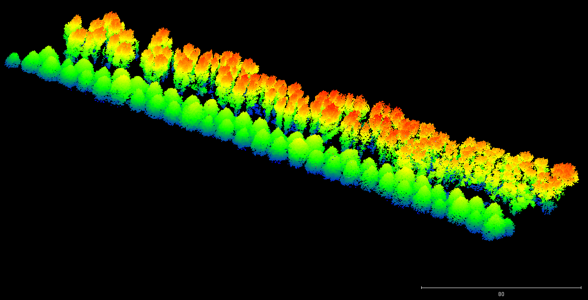
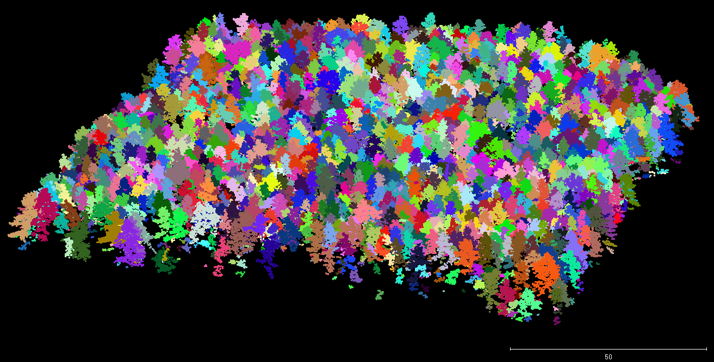
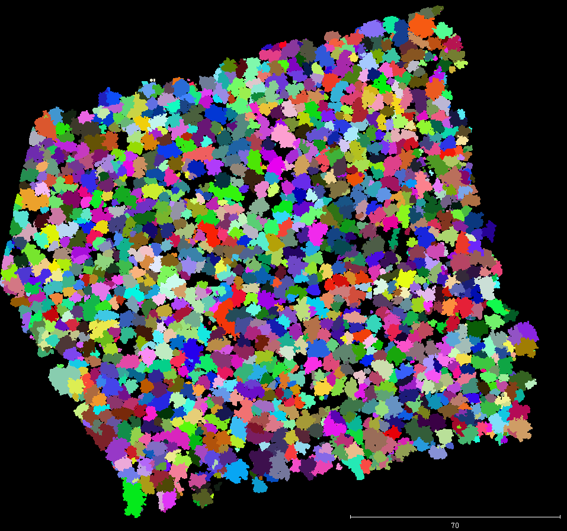
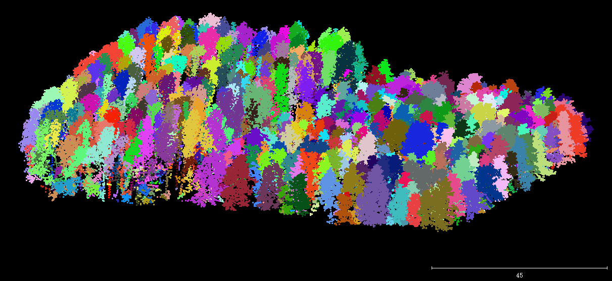
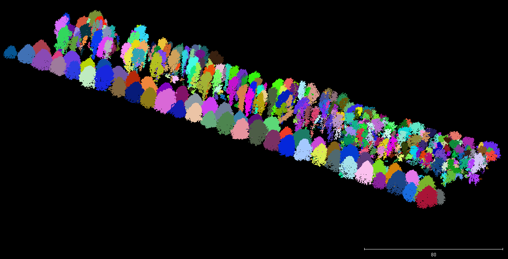

[](https://www.gnu.org/licenses/lgpl-3.0)

**Point-based Individual Tree Delineation from 3D LiDAR Point Cloud Data**

## Table of Contents

- [Introduction](#introduction)
- [File Structure](#file-structure)
- [Prerequisites](#prerequisites)
- [Input Data](#input-data)
- [Parameter Settings](#parameter-settings)
- [Output Format](#output-format)
- [Authors](#authors)
- [License](#license)

## Introduction

This module implements a lightweight and easy-to-use point-based method for individual tree delineation from 3D point cloud data obtained by airborne laser scanning. The repository provides three equivalent implementations of the algorithm to suit different workflows and performance needs:

1. **C++ Version:** A pure C++ implementation consisting of a project generated from Visual Studio 2015. The core class for tree separation is named `FoxTree` and can be found in the respective `FoxTree.h` and `FoxTree.cpp` files.
2. **Python Sequential Version:** A modern Python re-implementation utilizing `scipy.spatial.cKDTree` for rapid nearest-neighbor and radius searches, processing files one by one with detailed execution time tracking.
3. **Python Parallel Version:** An optimized Python version designed for batch processing. It utilizes multi-core processing to run the separation algorithm on multiple `.xyz` files simultaneously, drastically reducing the total execution time for large datasets.

## File structure
This repository is organized as follows:

```text
.
├── Results/                 # Directory for output formatting and results
├── TestDatasets/            # Sample 3D LiDAR point cloud datasets
├── TreeSeparation/          # Main source code directory (Visual Studio 2015 project, FoxTree.h, FoxTree.cpp, etc.)
├── tree_ind.py              # Python implementation of tree individualization - Sequential version
├── tree_ind_parallelized.py         # Python implementation of tree individualization - Parallelized version
├── compare_efficiency.py    # Compares the execution time of Sequential vs. Parallel Python implementations. 
├── .gitignore               # Git ignore rules
├── LICENSE                  # LGPL-3.0 License
└── README.md                # Project documentation
```

## Prerequisites

For the **C++ version**, a standard C++ compiler (e.g., MSVC via Visual Studio 2015 or later) is required.

For the **Python versions**, you will need Python 3.x and the following packages:

```bash
pip install numpy scipy
```

_(Note: The parallel version uses Python's built-in multiprocessing libraries, so no additional external dependencies are required)._

## Input Data

The input of this module is **TREE Points** only, as illustrated by the figures below.







The format of the tree points is **_\*.xyz_**, such as:

```javascript {.line-numbers}
         x            y         z
     623772.9200 4834465.5900 77.7409
        ...         ...        ...
```

For the **Python implementations**, simply place your input `.xyz` files into the `0_Test_Datasets` directory. The scripts will automatically detect and process all point cloud files found within it.

**Note:** If the original data does not have color information, either initiate the last three columns with arbitrary integers or modify the code upon data loading.

## Parameter Settings

There are three parameters that have to be initialized for optimal individualization results:

1. **Searching radius**
2. **Vertical resolution**
3. **Minimum number of points per cluster**

**Hints on Parameter Settings:**

- **radius:** should be in accordance with the average point density (i.e., to ensure there is a sufficient number of points within the radius).
- **verticalResolution:** depends on the overall point density and the desired fineness of the results.
- **miniPtsPerCluster** defines the minimum number of points to define a cluster.

### C++ Usage

Modify the variables in your main file _(Note that the parameters are based on geo-referenced point cloud data)_:

```cpp
// Parameter settings
const double radius = 1.0;               // Searching Radius, 1.0 meter
const double verticalResolution = 1.0;   // Vertical resolution of the layers, 1.0 meter
const int miniPtsPerCluster = 5;         // Minimum number of points per cluster, 5 points
```

### Python Usage

Modify the global variables under the `USER PARAMETERS` section at the bottom of the Python scripts:

```python
# Algorithm parameters
RADIUS = 1.0              # Search radius
VERTICAL_RESOLUTION = 1.0 # Vertical slice resolution
MIN_PTS_PER_CLUSTER = 5   # Minimum points to form a tree seed
```

_For the parallel version, you can also typically specify the number of CPU workers/cores to utilize for batch processing._

## Output Format

The output of this implementation is an ASCII format `*.xyz` file:

```text
treeID      x             y             z          r    g    b
89      623942.8999   4833932.5500   77.8399       36   76   89
```

Notably, the first column is the **index of the tree** to which this point is assigned. The last three columns are randomly designated RGB colors for the points belonging to the same tree, which is highly useful for direct visualization.

For the **Python versions**, outputs are automatically written to the `1_Individualized_trees` directory. The output filenames will automatically append your chosen parameters for easy tracking (e.g., `filename_1.0_1.0_5.xyz`).

The individual tree delineation results are given as the figures below:





In the C++ version, **nanoflann** is employed for **_KNN_** searching, which can be found from here [link](https://github.com/jlblancoc/nanoflann).

## Authors

Should you have any questions, comments, BUG(s) reporting, or IDEAS for further improvements? Please contact the authors

- **Jinhu Wang**
  jinhu.wang (at) hotmail.com
- **Roderik Lindenbergh**
  r.c.linderbergh (at) tudelft.nl
  http://doris.tudelft.nl/~rlindenbergh/

## License

This project is licensed under the LGPL-3.0 License - see the [LICENSE](LICENSE) file for details.

